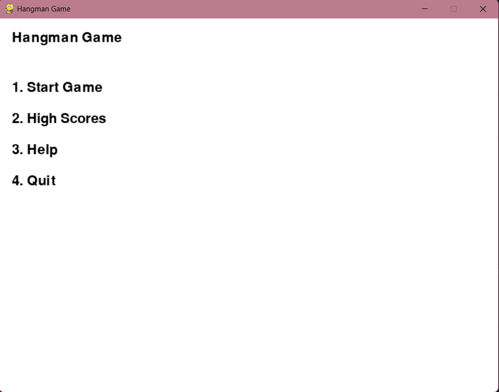
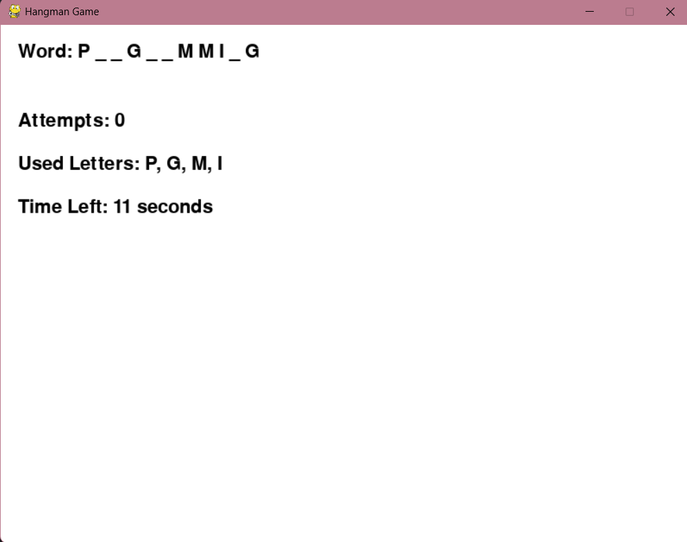
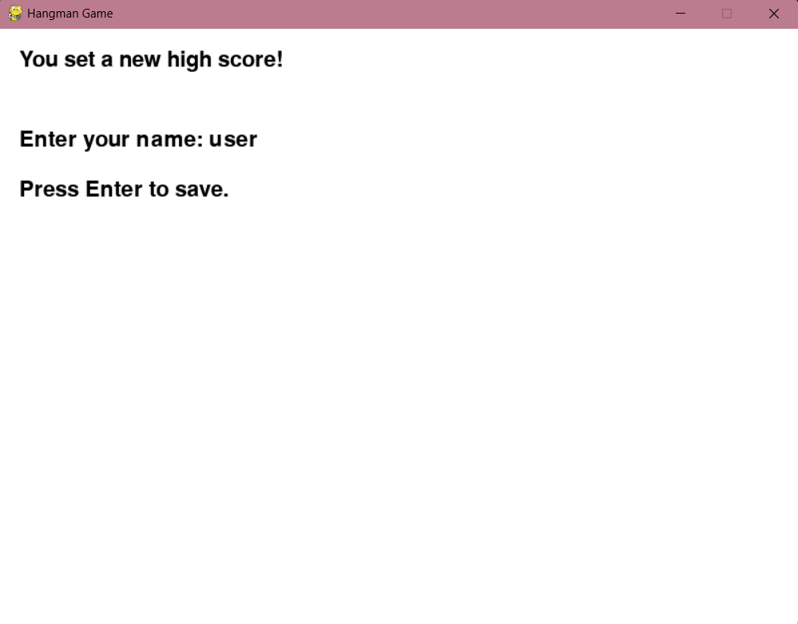
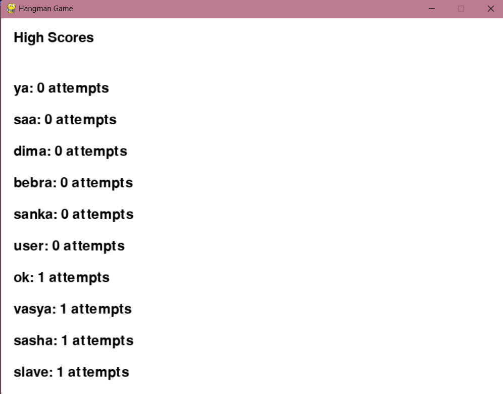
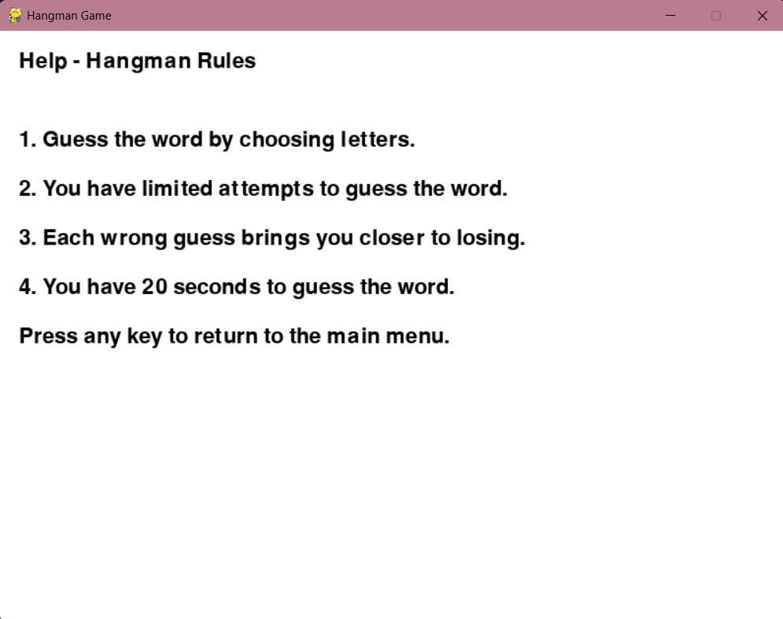

## Лабораторная работа №3

### Вариант: 14 (Hangman)

### Цель:
- Изучить событийно-ориентированное программирование с использованием библиотеки на языке Python (рекомендуется библиотека pygame)
### Задача: 
Разработать игровое графическое приложение согласно выбранному варианту. При разработке игры необходимо изучить функциональность оригинальной игры и по умолчанию реализовывать правила оригинальной игры

### Демонстрация разработанной игры:
### Меню:
В главном меню игры нас встречают команды: “Start game”, “High scores”, “Help”, “Exit”

### Start game:
- Сама игра отображает игровое поле, расположенное в левой части экрана, количество отгаданных и не отгаданных букв, а так же таймер.
  
- При отгадывании слова за отведённое время пользователя поздравляют, и если он установил рекорд, то записывает пользователя в таблицу, после чего начинается анимация.
  
### Records:
Здесь в виде списка показывается таблица рекордов, в порядке убывания (от большего к меньшему).

### Help:
Здесь кратко отображаются правила игры.

### Дополнительные требования:
- В игре присутствуют звуки: звук при нахождении неправильной буквы, звук при нахождении правильной буквы и фоновая музыка.
- Присутсвует анимация поздравления пользователя о новом рекорде
- Рекорды сохраняются в файл records.json

### Вывод:
При написании данной лабораторной работы я ознакомился с библиотекой pygame для создания игр. Библиотека позволяет программистам быстро писать небольшие проекты, при этом обеспечивая их всеми необходимами элементами для создания полноценных игр. 
