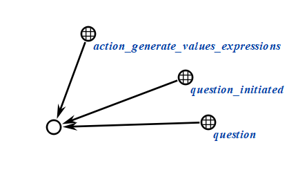
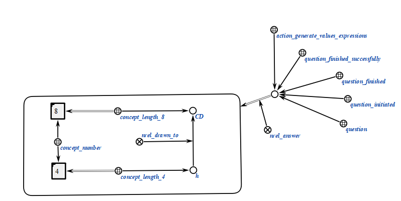
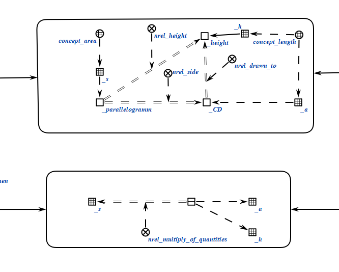
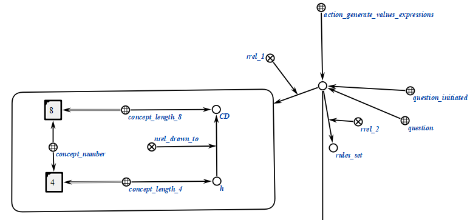
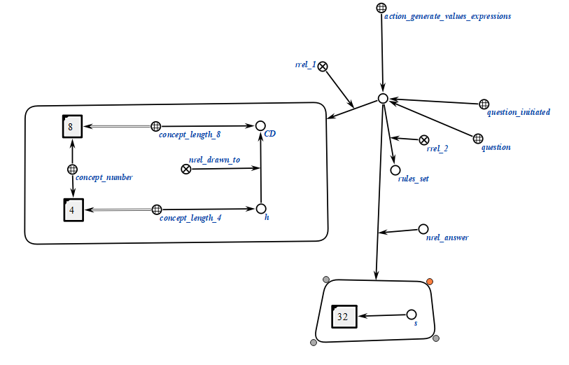

# Generate values expressoins

Агент создает набор значений.

**Класс действий**

`action_generate_values_expressoins`

**Ход работы агента**
1. Выбираются значения.
2. Эти выбранные значения присваиваются структуре. 

**Параметры:**

1. `input_structure` -- структура;
2. `rules_set` -- логические правила;

### Примеры
Пример входящей структуры:

</img>

Пример выходящей структуры:

</img>

### Результат

Возможные результаты выполнения:
 
* `SC_RESULT_OK` - агент успешно завершил работу;
* `SC_RESULT_ERROR`- internal error.

# Calculate value to find

Это агент вычисляет значение что мы ищем.

**Класс действий:**

`action_calculate_value_to_find`

**Параметры:**

1. `input_structure` -- структура;

**Ход работы агента**
1. Обработка полученной структуры. 
2. Вычисления по логическим правилам.
3. Вывод значения. 

### Примеры
Пример логического правила для создания текста:
</img>

Пример входящей структуры:

</img>

Пример выходной структуры:

</img>

### Результат

Возможные результаты выполнения:
 
* `SC_RESULT_OK` - сообщение выведено успешно;
* `SC_RESULT_ERROR`- internal error.
